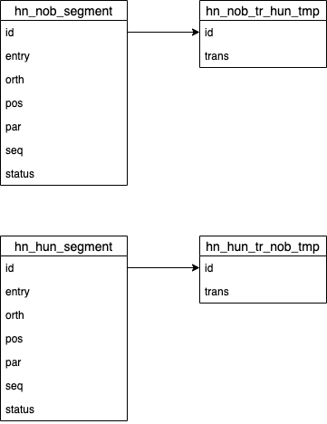
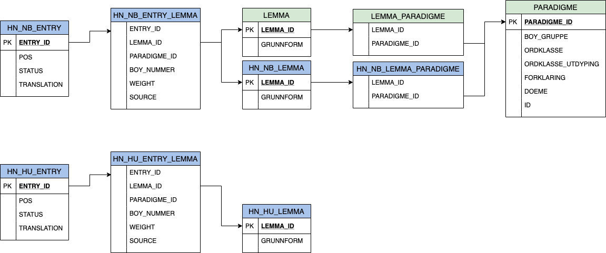

# Migration

Database version 2 mirrors the structure of FULLFORMSLISTE, and adds a table to store translations. The structure is the same for both languages.

The top level in version 3 is the dictionary entry, which includes translations, and link to lemma, both from Norsk ordbank and a custom lemma table. Inflection is defined for Norwegian words by connecting the lemma to paradigme. (Tables with green header are part of Norsk ordbank.)

# Production deployment notes

- Apache reverse proxy setup and headers: [docs/apache-reverse-proxy.md](docs/apache-reverse-proxy.md)
- Use `SPRING_PROFILES_ACTIVE=prod` to apply hardened cookie and proxy settings from `application-prod.properties`
